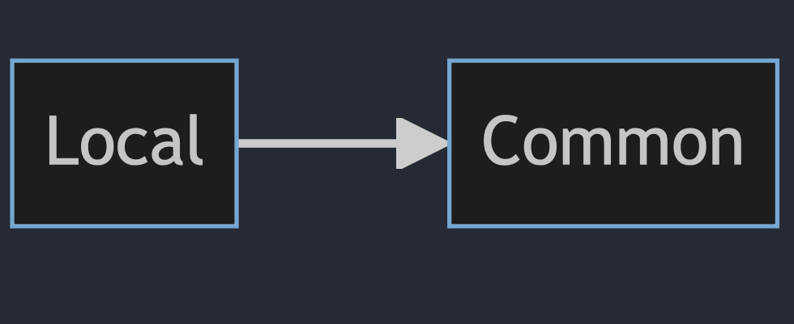

# Local

## Diagram


## Description
This section contains everything related to storing and retrieving images from the local device.

- Enum **"LocalError"** is used to define types of errors that can occur in the implementation of "LocalStorage."

- Protocol **"LocalStorage"** is used for communication with other parts of the system that need to interact with the "Local" section. It defines four functions:

```
  func fetchImageSize(imageUrl urlString: String) async throws -> PreviewMediaSizeDTO
 ```
 
  This function returns information about the image size. If for any reason it cannot find the image in the local storage or retrieve its data, it throws an error of type "LocalError."

<br>
```
  func fetchImage(imageUrl urlString: String) async throws -> UIImage
  ```

   This function attempts to retrieve an image from the local storage and returns it. If it cannot retrieve the image, it throws an error.

<br>
```
  func saveImageToDisk(imageUrl urlString: String, image: UIImage) async throws
  ```
   This function is responsible for saving an image to the local storage. It creates a separate directory for storing images, and if an image with the same name already exists, it does not save it and throws an error of type "LocalError" in case of any issues.

<br>
  ```
  func resetCache()
  ```
  This function is responsible for clearing the image folder. It doesn't throw any errors, even if it cannot perform the task.

<br>
The **private** function 
<br>

```
private func createCacheImageDirectoryIfNeeded()
```
 is used for creating a directory to store images. It's not part of the protocol and is part of the implementation.

<br>
All these functions and the **"LocalStorage"** protocol are implemented in **"LocalStorageImpl."**

Additionally, there is an extension called **"String+extractFileName"** that is responsible for extracting the image name from its URL.