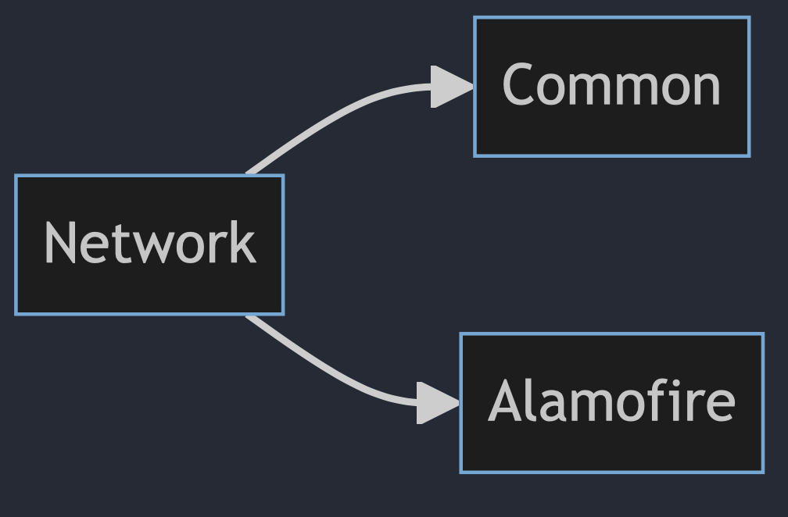

# Network

## Diagram


## Description
This section is responsible for communication with the **external** world outside of the application, and it includes the following:

- **"NetworkError"** enum: This is used to announce errors during server communication and is utilized in the implementation of the "Api" protocol.

- **"ApiRouter"** enum: This is used to create the required endpoints for the application. Currently, it has two endpoints:
  - **"mediaList"** for creating the address needed to fetch a list of data.
  - **"fetchImage"** for creating the address of the desired image. This enum implements the "URLRequestConvertible" protocol and is used in the server call section.

- **"Api"** protocol: This is used to establish communication with all units that need external data. It contains three functions:

<br>

```
  func callApi<T: Decodable>(route: ApiRouter, decodeType type: T.Type) async throws -> T
  ```

  In this function, we receive the desired address and the expected data type to be received from the server. If there is any error during retrieval (such as server unavailability or mapping issues), it throws an error.

<br>

  ```
  public func fetchImageSize(imageUrl urlString: String) async throws -> PreviewMediaSizeDTO
  ```
  
  This function receives the image URL and returns information about its size. In case of failure to retrieve the data, it throws an error.
  
  <br>

  ```
  public func fetchImageData(route: ApiRouter) async throws -> Data
  ```
  This function is responsible for downloading images by receiving the image's URL. In case of failure to retrieve the data, it throws an error.

<br>
- **"ApiImpl"** section: This part implements the "Api" protocol.

<br>
- **"DataResponse"** section: This part contains two types related to the storage of data obtained from the server:
<br>

  - **"MediaDTO"** for mapping Media data.
  - **"MediaTypeDTO"** for mapping the type of Media, which can be either a video or an image.