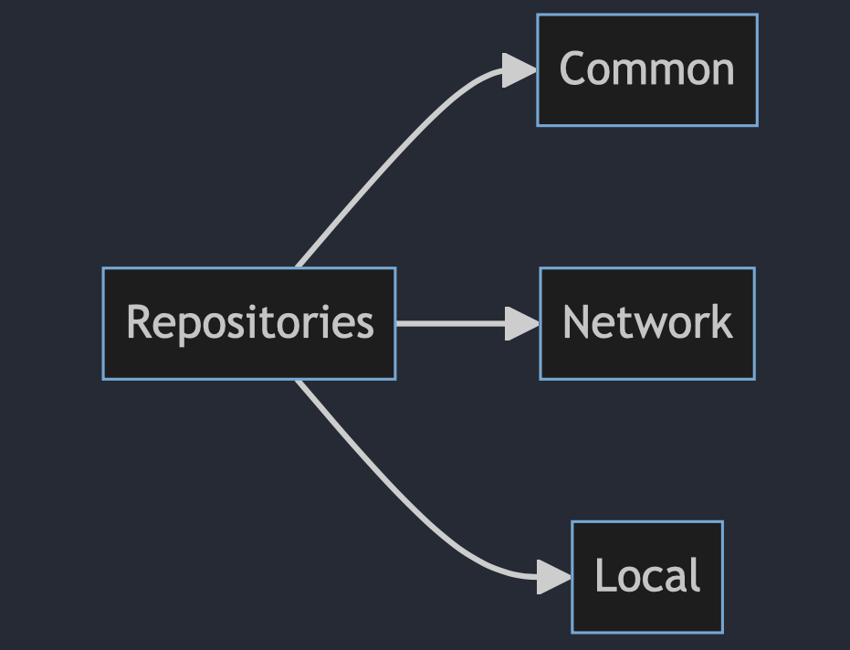

# Repositories

## Diagram


## Description
This is the main part of the **Data** module, responsible for communicating with the **Domain** module. It implements the protocols defined in the **Domain** module. Here are the key points:

<br>
- **"ImageError"** enum: It's used to report errors when we can't create an image from the provided data.

<br>
- **"MediaRepositoryImpl"**: In this section, the "MediaRepository" protocol is implemented, which includes one function:

<br>

```
  public func fetchMediaList() async throws -> [Domain.Media]
  ```
  
   This function connects to the server using the "Api" and returns the result after converting it to the desired entity. If an error occurs during retrieval, it's thrown. This class requires an implementation of the "Api" protocol and uses "MediaMapper" to convert Dto to the entity.

<br>
- **"ImageRepositoryImpl"**: In this section, the "ImageRepository" protocol is implemented, which includes the following functions:

<br>

```
public func fetchImageFromServer(imageUrl url: String) async throws -> UIImage
```
 This function attempts to retrieve an image from the server, and it may throw an error if it fails.

<br>

  ```
  public func fetchImageFromLocal(imageUrl url: String) async throws -> UIImage
  ```
   This function attempts to retrieve an image from the local storage, and it may throw an error if it fails.

<br>

  ```
  public func saveImageToDisk(imageUrl url: String, image: UIImage) async throws
  ```
  
   This function attempts to save an image to local storage, and it may throw an error in case of any issues.

<br>

  ```
  public func fetchImageSizeFromServer(imageUrl url: String) async throws -> Domain.PreviewMediaSize
  ```
  
   This function tries to fetch an image from the server and may throw an error if it fails. It's then converted to the desired entity using "PreviewMediaSizeMapper."

<br>

  ```
  public func fetchImageSizeFromLocal(imageUrl url: String) async throws -> Domain.PreviewMediaSize
  ```

   This function tries to retrieve an image from local storage and may throw an error if it fails. It's then converted to the desired entity using "PreviewMediaSizeMapper."

<br>

  ```
  public func resetCache()
  ```
   This function aims to clear the folder containing downloaded images.

  In this class, implementations of the **"Api"** and **"LocalStorage"** protocols are required.

<br>

- **"Mapper"** section: In this section, there are two parts for mapping between Dto and Entity:
  - **"MediaMapper"** implements the "Mapper" protocol.
  - **"MediaTypeMapper"** implements the "Mapper" protocol.