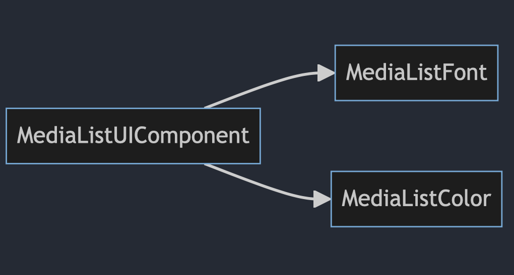

# MediaListUIKit

## Diagram

## Description
In the **"MediaListUIKit"** section, you'll find everything related to the user interface (UI) needs of the application. It includes the following targets:

1. **MediaListColor:**
   - In this section, colors required for the app are created using the `MediaListTheme` class.

2. **MediaListFont:**
   - This section provides everything needed to create and use fonts, including two parts:
     - **MediaListFont:** This class is responsible for registering fonts required in the main app. It must be invoked at the beginning of the app as `MediaListFont.registerFonts()`.
     - **Raleway:** An enum that creates fonts with specific weights, including regular, semiBold, and extraBold. It is used to retrieve the Raleway font. You can obtain fonts based on text styles or font sizes using two functions: 
       - `func customFont(basedOnTextStyle textStyle: Font.TextStyle) -> Font`
       - `public func customFont(basedOnFontSize size: CGFloat) -> Font`

3. **MediaListUIComponent:**
   - In this section, essential UI components are created, which include the following:
     - **PreviewImage:** This component displays an image. It shows a default image before the actual image is loaded.
     - **DetailText, ListText, TitleText:** These components generate text based on their usage location, with different font weights.
