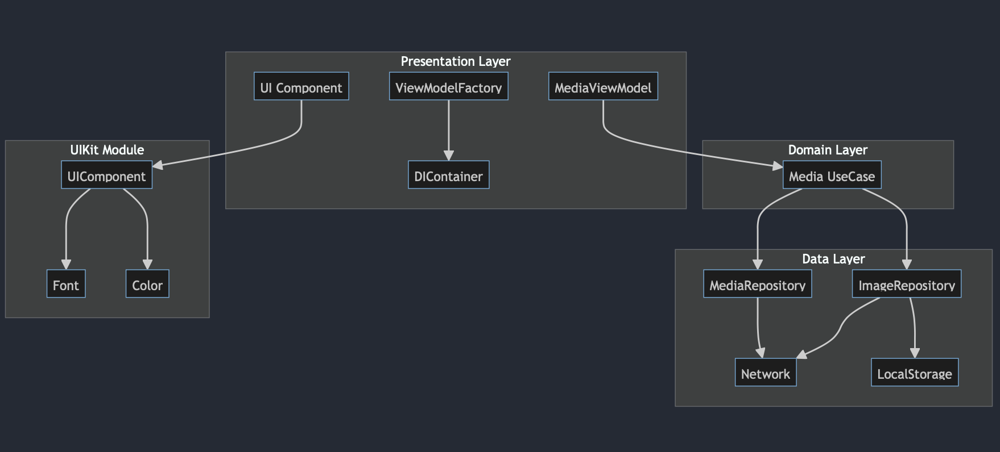
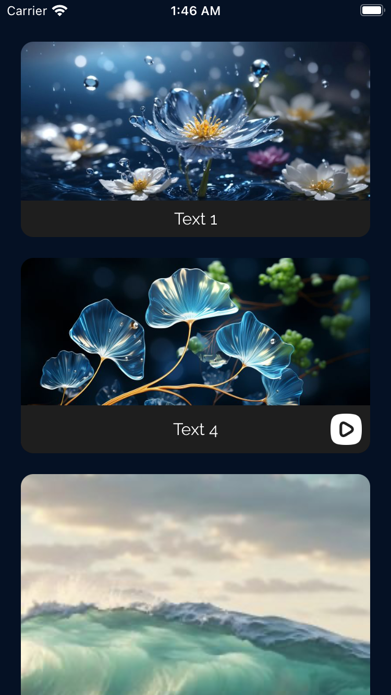

# MediaList 

## Diagram

## Description
This application is implemented using the **MVVM (Model-View-ViewModel)** pattern along with the **Clean Architecture**. It is structured into three separate modules: Data, Domain, and MediaListUIKit. These modules are organized in a Monorepo setup, managed using Swift Package Manager, and all the modules are kept within a single package.

## The tech stack used in this project 🛠

- SwiftUI
- MVVM + clean architecture
- Unit Test + MockURL
- async / await (Structured concurrency)
- Combine
- Http client (Alamofire)

## Tools
- Xcode 14.3.1
- Swift 5.8.1

## Screenshots 🌃 

## MonoRepo
In a **Monorepo** setup, multiple related projects are stored in a **single repository**, making it easier to manage and share code between them.
 
[monorepo.tools](https://monorepo.tools)

## Modules
- **Data Module**: Contains implementations related to repository, network, and local storage.
- **Domain Module**: Consists of repository protocols, use cases, and entities.
- **MediaListUIKit Module**: Contains Colors, Fonts, and views.

For more detailed information about each module, you can refer to the following links:
 
 
[DataREADME](Data/README.md)
 
 
[DomainREADME](Domain/README.md)
 
 
[MediaListUIKitREADME](MediaListUIKit/README.md)

## Clean Architecture + MVVM

- **Data Layer:** This layer includes repository implementations, network-related components, and local storage handling.

- **Domain Layer:** Here, you'll find repository protocols, use cases (interactors), and entities that represent the core business logic and data structures.

- **Presentation Layer:** This layer is divided into view models (ViewModels) and views (Views) responsible for presenting the user interface and handling the user interactions.

## Presentation Layer
It's important to note that the **Presentation layer** is part of the **main app** and **is not organized as a separate module**.

 
In the Presentation section, the following key components are present:

1. **AppDelegate:** This class manages the application's lifecycle. It begins by registering the necessary fonts. It also creates the container required for Dependency Injection, which is utilized by the `ViewModelFactory`.

2. **DIContainer (Dependency Injection Container):** This protocol is responsible for creating the desired use cases. It should be passed to view models that need these use cases. 

   By implementing `DIContainerImpl`, we fulfill the DIContainer protocol, and this is where everything needed to construct use cases is assembled.

3. **ViewModelFactory:** The purpose of this class is to create view models. It handles the creation of view models that may require specific use cases. In this scenario, views don't directly get involved in the construction of view models; instead, the ViewModelFactory takes care of it.

## Roadmap

- [ ] Test
  - [ ] UItest cases.
  - [ ] Test plan.
- [ ] CI
  - [ ] setup Github Action.

## Note

If the links in the MD files are not working, it's better to clone the source code and view it using VSCode. I have no idea why it's not working.

###  Contributing 🤝

Contributions, issues, and feature requests are welcome! Feel free to fork the repository and submit a pull request with your changes.

## License

Please check [LICENSE](LICENSE) for details.